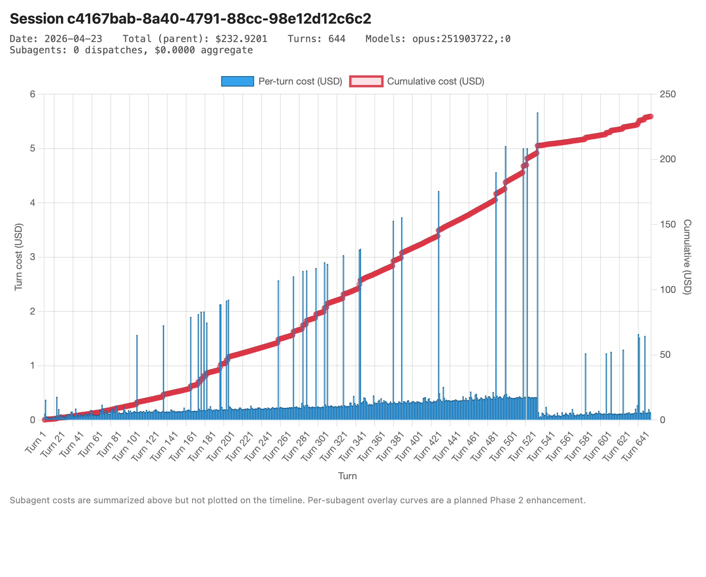
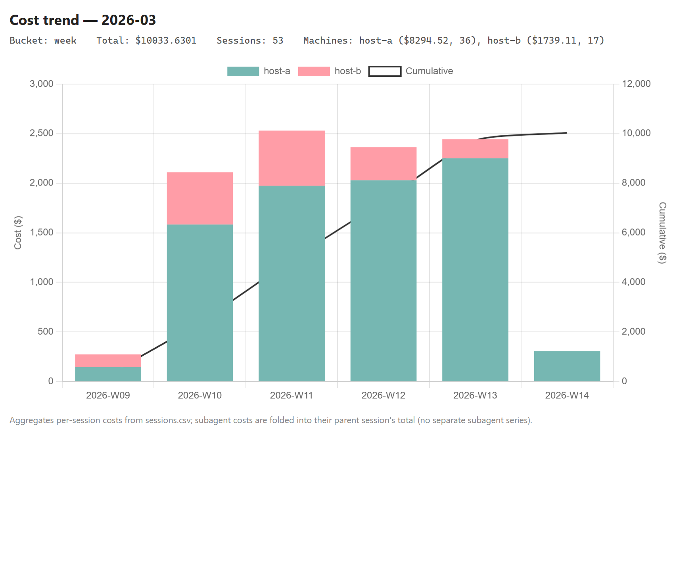
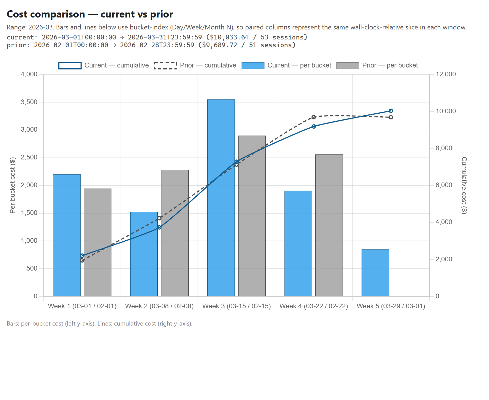

# cost-estimator

A Claude Code skill that analyzes cost and active time from local session
JSONLs.
Two halves planned:

- **Retrospective — built (2026-05-04).** "What did I spend over [date
  range]?" Walks `~/.claude/projects` (and equivalent on other hosts),
  dedupes assistant turns by `message.id`, prices each turn per the
  canonical Anthropic rate table, and reports per-session, daily, and
  waste-pattern breakdowns. Skill body in `SKILL.md`,
  scripts in `scripts/`.
- **Retrospective time analysis (built 2026-08-03).** Sums Claude Code's
  recorded per-turn wall clock for the same date ranges, reports parent wait
  time separately from concurrent subagent processing, and attributes timed
  slash-command turns so questions like "how long did I wait on `/wrap`?"
  have a measured answer.
- **Predictive — planned.** "How much will it cost to [some future
  task]?" Uses Anthropic's `count_tokens` API + heuristics + the
  retrospective dataset as a reference. Design notes below.

## Per-session cost graph

Once `analyze-month.py` flags a session as a top spender, drill in with
`scripts/plot-session.py` to see *where* the cost accrued. It produces
a self-contained HTML page with a Chart.js mixed bar + line plot:
per-turn cost as bars (left axis), cumulative cost as a line (right
axis). Hover any bar for model, top tools, tokens, and timestamp.



```bash
python scripts/plot-session.py <session-id-prefix> --open
# or pass a full JSONL path; --x time switches the x-axis to wall clock;
# --inline-js embeds Chart.js so the page works offline.
```

Output lands in `~/.claude/cost-estimator/reports/session-<id-prefix>.html`
(override with `CLAUDE_COST_REPORTS_DIR`).
Subagent costs are summarized in the page header but not overlaid on
the timeline — that's a planned Phase 2.

## Active time and slash commands

`analyze-month.py` reads `system` records whose subtype is `turn_duration`.
These are measured active turns, not timestamp-gap estimates, so idle time
between prompts is excluded. Parent time represents user wait time. Subagent
time is reported separately because concurrent subagents cannot be added
without double-counting elapsed time.

The analyzer writes `commands.csv` alongside `sessions.csv` and `daily.csv`.
To inspect one slash command across the selected range:

```bash
python scripts/analyze-month.py ~/.claude/projects --month 2026-07
python scripts/summarize.py --command /wrap
```

The command summary reports measured duration, invocation count, session count,
and per-session detail. Older invocations without `turn_duration` records are
left unestimated.

## Trend across sessions

After running `analyze-month.py` for the range you care about, render
the aggregate trend:

```bash
python scripts/plot-trend.py --month 2026-04 --open
```

Stacked bars show per-machine cost in each bucket (day / week / month,
auto-picked from range length or set with `--bucket`). The right-axis
line is the cumulative total. Multi-machine setups can pre-set
`CLAUDE_COST_ROOTS="host-a:C:/Users/you/.claude/projects,host-b:Y:/.claude/projects"`
so `analyze-month.py` picks up every root without repeating CLI args.



## Comparing two windows

To check whether spend is trending up or down, render any window
against the same-length prior window:

```bash
python scripts/plot-compare.py --last 168h --open    # past 168h vs prior 168h
python scripts/plot-compare.py --month 2026-04 --open  # April vs March
```

The prior window is auto-derived (no second range to specify). The chart
shows grouped bars (current vs prior side by side) per bucket and twin
cumulative lines on a right axis. Bucket-index makes paired bars
apples-to-apples wall-clock-relative slices — Day 1 covers the first 24h
of each window, not the same calendar date.



## Reconciling against /stats

The analyzer prices *surviving* transcripts. Under Claude Code's old
30-day retention, heavy old days were garbage-collected before they could
be priced, so a report for a pre-retention window undercounts. The
`stats-cache.json` behind the `/stats` dashboard keeps a per-machine
`dailyModelTokens` aggregate that survives transcript deletion — the only
fossil record of those days.

`analyze-month.py` prints a "COVERAGE vs /stats" guardrail automatically;
for the full per-day breakdown run:

```bash
python scripts/stats_cache.py ~/.claude/projects --month 2026-04
```

It classifies each day as match / partial / **cleared** and reports a
coverage %. The comparison is raw-transcript-in+out vs `/stats`
`dailyModelTokens` — both non-deduped, so they agree to the token on
intact days (verified), and a low coverage means real data loss, not the
~3.2× no-dedup artifact that bites a deduped-vs-raw comparison. `/stats`
carries no dollars and no cache, so cleared days are flagged and counted
but not priced; the report labels the affected total a floor.

## Cache TTL diagnostic

`scripts/cache_ttl.py <root>` reports the `ephemeral_5m` vs `ephemeral_1h`
split of cache-write tokens and an inter-turn-gap behavioral table — for
confirming whether the account writes 1h-TTL cache (the subscription
default) or is leaking cost to 5m-TTL prefix expiry.

## Files

- `SKILL.md` — the retrospective skill (the working part).
- `scripts/pricing.py` — canonical pricing formula and JSONL
  turn-iterator, shared by the analyzer and plotter.
- `scripts/chart_runtime.py` — shared Chart.js version constants,
  CDN/inline download cache, and `<script>` tag builder used by
  both plotters.
- `scripts/analyze-month.py` - JSONL walker, per-turn pricer, measured time
  extractor, and `sessions.csv` / `daily.csv` / `commands.csv` writer. It also
  prints the "COVERAGE vs /stats" guardrail.
- `scripts/roots.py` — shared root resolution, date-bound parsers, and
  `stats_file_for()`. Imported by the analyzer, `stats_cache.py`, and
  `cache_ttl.py`.
- `scripts/stats_cache.py` — reconciles surviving transcripts against the
  per-machine `/stats` `stats-cache.json`; flags cache-cleared days and
  reports coverage %. Standalone CLI + helpers the analyzer imports.
- `scripts/cache_ttl.py` — cache-write TTL (5m vs 1h) diagnostic.
- `scripts/summarize.py` - CSV reader plus cost, active-time, slash-command,
  and waste-pattern report. Accepts `--command /name` for focused detail.
- `scripts/plot-session.py` — render a single session's per-turn
  cost trajectory as an interactive HTML chart (Chart.js). Useful for
  investigating a session that `summarize.py` flagged as a top
  spender; shows where in the session the cost actually accrued.
- `scripts/plot-trend.py` — render aggregate cost trend across
  sessions as a stacked-bar + cumulative-line HTML chart
  (reads `sessions.csv` from `analyze-month.py`).
- `scripts/plot-compare.py` — render any window vs the same-length
  prior window as an overlay chart (grouped bars + twin cumulative
  lines). Uses bucket-index within each window so paired bars are
  apples-to-apples wall-clock-relative slices.
- `scripts/trend_data.py` — shared bucket math, CSV reader, and
  range parsers (month / range / duration). Imported by both
  `plot-trend.py` and `plot-compare.py`.
- `dev/capture-screenshot.py` — headless Chrome wrapper used by
  the screenshot regen scripts. Dev-only (excluded from `install-skills`).
- `dev/regen-screenshots.{sh,bat}` — orchestrator that regenerates
  the README PNGs by running plot-trend + plot-compare against the
  demo fixture and capturing each to a 1760x1440 PNG. Dev-only.
- `tests/fixtures/sessions-demo.csv` — synthetic two-host two-month
  sessions data used by `regen-screenshots`. Dev-only.
- `screenshot-trend.png`, `screenshot-compare.png` — README screenshots
  regenerated by `dev/regen-screenshots`.
- `reports/` — dev-only screenshot-fixture scratch (see `dev/regen-screenshots`);
  gitignored. Generated cost data now lands in `~/.claude/cost-estimator/reports/`.
- `.gitignore` — keeps the dev `reports/` scratch and CSV outputs out of git.

## Predictive companion (planned)

**Scope: future cost, not future time.** The retrospective analyzer reports
measured active time for work that already happened. Estimating how *long* a
future task will take is the `progress-beacon` skill's job (its calibrated
ETA); this predictive companion owns the future *spend* question only.

The originating user goal: get a defensible cost estimate **before**
invoking Claude on a task. Concrete shapes:

- "How much would it cost to summarize these 50 files?"
- "If I let an agent loop on this codebase for 8 hours, what's that cost?"
- "What does it cost to add this 3KB system prompt to every turn?"
- "How much to implement this plan?" (the abstract one)

### Build path

A pragmatic v1 → v2 split, tightest first.

**v1 — bounded subcases (math is exact).** All three are deterministic
given input tokens and a turn count:

- "Cost to summarize N files" → `count_tokens` on file contents, pick a
  model, fixed output estimate (~200–500 tokens), arithmetic.
- "Cost to add a 5KB system prompt to every turn for K turns" →
  `count_tokens` once, multiply by K, apply cache-write/read split.
- "Cost of an agent loop for K iterations of T turns each" → same shape.

**v2 — fuzzy plan estimation (needs heuristics).** Two plausible
foundations:

1. **LLM-based turn-count estimator.** Show the plan to Claude, ask
   "how many turns?" Brittle but usable for first-cut bounds.
2. **Regression on the historical dataset.** The retrospective half
   produced a `sessions.csv` with hundreds of labeled rows (cost,
   turns, top tools, models, subagents). If the user labels a sample
   by task profile — "refactor", "debug", "feature build",
   "exploration" — that becomes training input for a per-profile
   $/turn estimator.

v2 should report ranges, not point estimates, and explicitly call out
the assumption that drove the bounds.

### Name-collision notes

Two built-in slash commands already exist in Claude Code that this skill
does **not** want to collide with:

- `/cost` — current-session per-model breakdown (Claude Code v2.1.92+).
- `/cost-estimate` — scans a codebase to compute what it would have cost
  a human team to build it. Different purpose entirely.

The retrospective half cross-validates against `ryoppippi/ccusage`
(<https://github.com/ryoppippi/ccusage>) as a sanity check; that's the
only third-party tool the skill body references.

### Technical primitive — `count_tokens` API

- Docs: <https://docs.anthropic.com/en/docs/build-with-claude/token-counting>
- Free to use, subject to RPM rate limits per usage tier.
- Returns the exact input token count for any messages array.
- Note: the count "should be considered an estimate" — actual billing
  may differ slightly due to system-added tokens (orchestration
  overhead, not billed).

**Auth concern unresolved.** The user's `~/.claude/.credentials.json`
holds an OAuth Bearer used for the subscription path. Works for the
undocumented `/api/oauth/usage` endpoint (with `anthropic-beta:
oauth-2025-04-20`). Unknown whether it works for `count_tokens`. First
job for the predictive build is to probe it:

```bash
TOKEN=$(python3 -c "import json,os; print(json.load(open(os.path.expanduser('~/.claude/.credentials.json')))['claudeAiOauth']['accessToken'])")
curl -s https://api.anthropic.com/v1/messages/count_tokens \
  -H "Authorization: Bearer $TOKEN" \
  -H "anthropic-beta: oauth-2025-04-20" \
  -H "anthropic-version: 2023-06-01" \
  -H "Content-Type: application/json" \
  -d '{"model":"claude-opus-4-7","messages":[{"role":"user","content":"hello"}]}'
```

200 with `{"input_tokens": N}` → OAuth works. 401/403 → fall back to
Console API key (`ANTHROPIC_API_KEY` env var); document that the
predictive half requires a separate API key.

### Test cases for the predictive skill

End-to-end validation when v1 lands:

- "How much to summarize the files in `src/components/`?" → reads files,
  counts tokens, estimates output ≈ 200 tokens, multiplies.
- "How much for an agent that reads 10 docs and writes 1 page of
  analysis?" → mid-range estimate with explicit assumptions.
- "Cost of adding a 5KB system prompt to every turn for the rest of a
  session expected to be 100 turns long?" → repeat-input arithmetic
  with cache-write/read modeling.

### Build conventions for v1

The skill should:

- Trigger on phrases like "how much will it cost", "estimate cost",
  "predict spend", "what would XYZ cost", "cost projection".
- Call `count_tokens` on actual content (files, draft prompts) — don't
  use char/4 heuristics.
- Heuristic-estimate output tokens by task type (code edit ≈ N tokens,
  summary ≈ M, agent-loop iteration ≈ K). Bound uncertainty
  explicitly: "between $X and $Y".
- Pin the pricing table inline (don't depend on memory notes — skill
  should stay self-contained, eventually publishable).
- Honor the cache-write/read multipliers. The Opus 1M-context tier bills
  at the flat rate (no surcharge above 200K).
- Present output as a breakdown: input cost + output cost + cache
  savings (if applicable) + total range.
